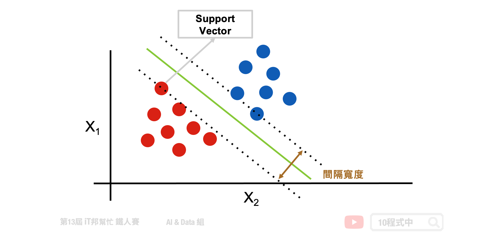
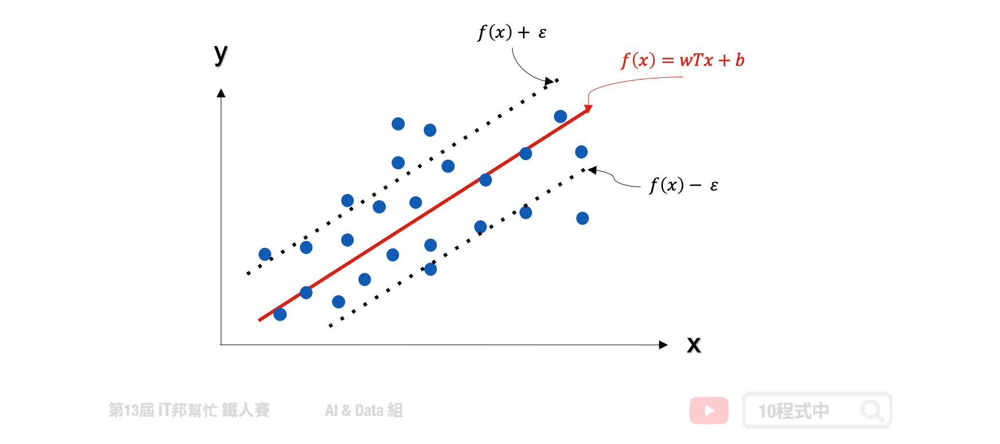
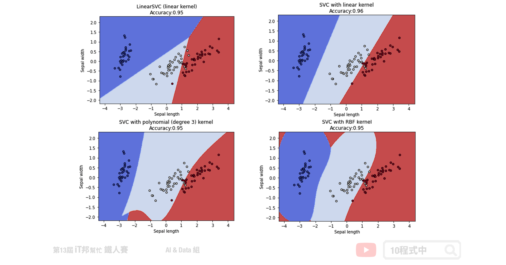

# 核模型 - 支持向量機 (SVM)
## 今日學習目標
- SVM 分類器
    - 何謂支持向量機? 非線性與線性?
    - 多元分類支持向量機。
- SVR 迴歸器
    - 學習 SVR 方法如何處理連續性輸出。
- SVM 分類器與 SVR 迴歸器手把手實作
    - 藉由圖形化的邊界，來了解使用不同的 Kernel 及不同參數的意義。
    - 查看 SVR 方法在簡單線性迴歸和非線性迴歸表現。

<iframe width="560" height="315" src="https://www.youtube.com/embed/" frameborder="0" allow="accelerometer; autoplay; clipboard-write; encrypted-media; gyroscope; picture-in-picture" allowfullscreen></iframe>

範例程式 SVM(Classification)：[](https://colab.research.google.com/github/andy6804tw/2021-13th-ironman/blob/main/docs/11.SVM/11.1.SVM(Classification-iris).ipynb)

範例程式 SVR(Regression)：[](https://colab.research.google.com/github/andy6804tw/2021-13th-ironman/blob/main/docs/11.SVM/11.2.SVR(Regression).ipynb)

## SVM 分類器
支持向量機 (support vector machine, SVM) 是一個基於統計學習的監督式演算法，透過找出一個超平面，使之將兩個不同的集合分開。一般的分類問題我們就是要，找出在不同的資料類別中的分隔線。但在一般狀況下這個分隔線非常複雜且有很多種可能。然而 SVM 就是要在這很多種的可能當中找出最佳的解。SVM 演算法的精神就是找出一條分隔線使所有在邊界上的點離得越遠越好，使模型抵抗雜訊的能力更佳。

SVM 可分為以下兩種：
- 線性可分支持向量機
- 非線性可分支持向量機

## 線性可分支持向量機
線性可分支持向量機就是在下圖範例的二維圖形中找出一條線，目標讓這條直線與兩個類別之間的間隔寬度距離最大化。其中離兩條虛線(間隔超平面)距離最近的點，就稱為支持向量 (support vector)。



當然現實生活中的資料往往稍微複雜，那如果不是線性可分集合怎麼辦呢？我們可以運用核函數(kernel function) 幫我們造出不可分的分割平面。


## 非線性可分支持向量機
除了進行線性分類之外 SVM 還可以使用核技巧有效地進行非線性分類，將其輸入的資料投到更高維度的空間，並在高維度的空間進行高維度的分類或降維。簡單來說透過多維度的投影技巧，將原本在二維空間中不可分的點到了三維空間就可分了。但是隨著資料量增加其運算也會變多，相對的執行速度就會變慢。

兩個非線性的 Kernel：
- Polynomial 高次方轉換
- Radial Basis Function 高斯轉換


## 多元分類支持向量機
SVM 演算法最初是為二元分類問題所設計的，但是現實生活中的例子一定不只有兩類的問題要解決。他的解決方式與 `[Day 9 邏輯迴歸]` 所提到的多元分類邏輯迴歸是一樣的。主要是將一個多元分類問題轉換為多個二元分類問題。常見方法包括 one-vs-rest(OvR) 和 many-vs-many(MvM) 兩種。

- one-vs-rest(OvR)
    - 將某個類別的樣本歸為一類，其他剩餘的樣本歸為另一類
- many-vs-many(MvM)
    - 在任意兩類樣本之間設計一個 SVM

> 詳細介紹可以參考 [[Day 9 邏輯迴歸]](https://ithelp.ithome.com.tw/articles/10269006)

## SVR 迴歸器
支持向量機（SVM）是專門處理分類的問題，還有另一個名詞稱為支持向量迴歸（Support Vector Regression, SVR）專門處理迴歸問題。SVR 是 SVM 的延伸，而支持向量迴歸只要 `f(x)` 與 y 偏離程度不要太大，既可以認為預測正確。如下圖中的迴歸範例，在線性的 SVR 模型中會在左右加上 𝜀 作為模型容忍的區間。因此在訓練過程中只有在虛線以外的誤差才會被計算。此外 SVR 也提供了線性與非線性的核技巧，其中在非線性的模型中可以使用高次方轉換或是高斯轉換。




## [程式實作]
## 支持向量機 (Support Vector Machine, SVM) 模型
SVM 能夠透過超參數 C 來達到 weight regularization 來限制模型的複雜度。除了這點我們還能透過 SVM 的 Kernel trick 的方式將資料做非線性轉換，常見的 kernel 除了 linear 線性以外還有兩了非線性的 Polynomial 高次方轉換以及 Radial Basis Function 高斯轉換。

四種不同SVC分類器:
1. LinearSVC  (線性)
2. kernel='linear'  (線性)
3. kernel='poly'  (非線性)
4. kernel='rbf'  (非線性)

Methods:
- fit: 放入X、y進行模型擬合。
- predict: 預測並回傳預測類別。
- score: 預測成功的比例。
- predict_proba: 預測每個類別的機率值。

### LinearSVC
Parameters:
- C: 限制模型的複雜度，防止過度擬合。
- max_iter: 最大迭代次數，預設1000。

```py
from sklearn import svm

# 建立 linearSvc 模型
linearSvcModel=svm.LinearSVC(C=1, max_iter=10000)
# 使用訓練資料訓練模型
linearSvcModel.fit(train_reduced, y_train)
# 使用訓練資料預測分類
predicted=linearSvcModel.predict(train_reduced)
# 計算準確率
accuracy = linearSvcModel.score(train_reduced, y_train)
```

> 訓練集 Accuracy: 0.96

### kernel='linear'
Parameters:
- C: 限制模型的複雜度，防止過度擬合。
- kernel: 此範例採用線性。

```py
from sklearn import svm

# 建立 kernel='linear' 模型
svcModel=svm.SVC(kernel='linear', C=1)
# 使用訓練資料訓練模型
svcModel.fit(train_reduced, y_train)
# 使用訓練資料預測分類
predicted=svcModel.predict(train_reduced)
# 計算準確率
accuracy = svcModel.score(train_reduced, y_train)
```

> 訓練集 Accuracy: 0.97

### kernel='poly'
Parameters:
- C: 限制模型的複雜度，防止過度擬合。
- kernel: 此範例採用 Polynomial 高次方轉換。
- degree: 增加模型複雜度，3 代表轉換到三次空間進行分類。
- gamma: 數值越大越能做複雜的分類邊界。

```py
from sklearn import svm

# 建立 kernel='poly' 模型
polyModel=svm.SVC(kernel='poly', degree=3, gamma='auto', C=1)
# 使用訓練資料訓練模型
polyModel.fit(train_reduced, y_train)
# 使用訓練資料預測分類
predicted=polyModel.predict(train_reduced)
# 計算準確率
accuracy = polyModel.score(train_reduced, y_train)
```

> 訓練集 Accuracy: 0.97

### kernel='rbf'
Parameters:
- C: 限制模型的複雜度，防止過度擬合。
- kernel: 此範例採用 Radial Basis Function 高斯轉換。
- gamma: 數值越大越能做複雜的分類邊界

```py
from sklearn import svm

# 建立 kernel='rbf' 模型
rbfModel=svm.SVC(kernel='rbf', gamma=0.7, C=1)
# 使用訓練資料訓練模型
rbfModel.fit(train_reduced, y_train)
# 使用訓練資料預測分類
predicted=rbfModel.predict(train_reduced)
# 計算準確率
accuracy = rbfModel.score(train_reduced, y_train)
```

> 訓練集 Accuracy: 0.97

我們藉由圖形化的邊界，來了解使用不同的 Kernel 及不同參數的意義。以下範例將原先 鳶尾花朵資料集四個特徵透過 PCA 降成二維，以利我們做視覺化觀察。透過四種不同的 SVC 實驗我們可以發現不同的核技巧所預測出來的決策邊線都不盡相同。然而越複雜的模型相對的邊界就會變得越扭曲，因為非線性的模型能夠有比較好的擬合使得錯誤率降低。



## 支持向量迴歸（Support Vector Regression, SVR） 模型
在 Sklearn 中 SVM 提供迴歸的模型稱作 SVR。此外 SVR 迴歸器也提供了三種不同的核函數，分別有一個線性以及兩個非線性的模型可以呼叫。在 SVR 迴歸的實驗，我們拿一組非線性的資料作為例子。並查看在不同的核技巧下模型所擬合的成效為何？

三種不同SVR迴歸器:
1. kernel='linear'  (線性)
2. kernel='poly'  (非線性)
3. kernel='rbf'  (非線性)

Methods:
- fit: 放入X、y進行模型擬合。
- predict: 預測並回傳預測類別。
- score: 預測成功的比例。

### kernel='linear'
Parameters:
- C: 限制模型的複雜度，防止過度擬合。
- kernel: 此範例採用線性。

```py
from sklearn import svm

# 建立 kernel='linear' 模型
linearModel=svm.SVR(C=1, kernel='linear')
# 使用訓練資料訓練模型
linearModel.fit(x, y)
# 使用訓練資料預測分類
predicted=linearModel.predict(x_test)
```

> 訓練集 MSE:  5.903802524650818

### kernel='poly'
Parameters:
- C: 限制模型的複雜度，防止過度擬合。
- kernel: 此範例採用 Polynomial 高次方轉換。
- degree: 增加模型複雜度，3 代表轉換到三次空間進行分類。
- gamma: 數值越大越能做複雜的預測。

```py
from sklearn import svm

# 建立 kernel='poly' 模型
polyModel=svm.SVR(C=6, kernel='poly', degree=3, gamma='auto')
# 使用訓練資料訓練模型
polyModel.fit(x, y)
# 使用訓練資料預測分類
predicted=polyModel.predict(x_test)
```

> 訓練集 MSE:  8.296270605383441

### kernel='rbf'
Parameters:
- C: 限制模型的複雜度，防止過度擬合。
- kernel: 此範例採用 Radial Basis Function 高斯轉換。
- gamma: 數值越大越能做複雜的分類邊界。

```py
from sklearn import svm

# 建立 kernel='rbf' 模型
rbfModel=svm.SVR(C=6, kernel='rbf', gamma='auto')
# 使用訓練資料訓練模型
rbfModel.fit(x, y)
# 使用訓練資料預測分類
predicted=rbfModel.predict(x_test)
```

> 訓練集 MSE:  2.2551572190243157

這裡的迴歸模型採用非線性的資料進行數據擬合的實驗。我們可以發現線性的核函數無法有效的預測所有數據點的趨勢。而非線性的模型中 RBF 的模型對於此資料有比較好的預測結果。


本系列教學內容及範例程式都可以從我的 [GitHub](https://github.com/andy6804tw/2021-13th-ironman) 取得！