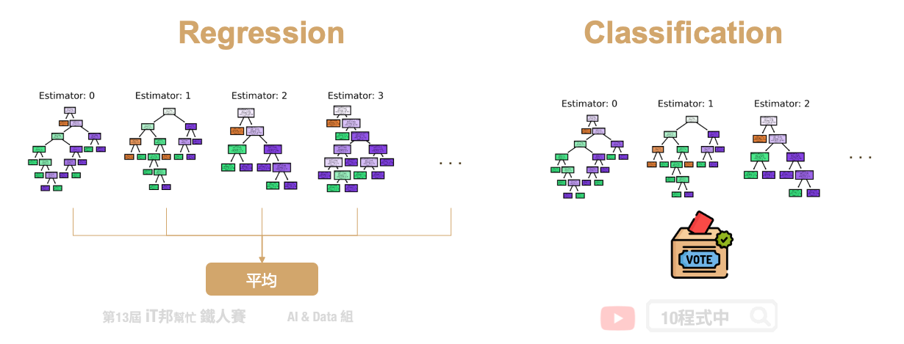
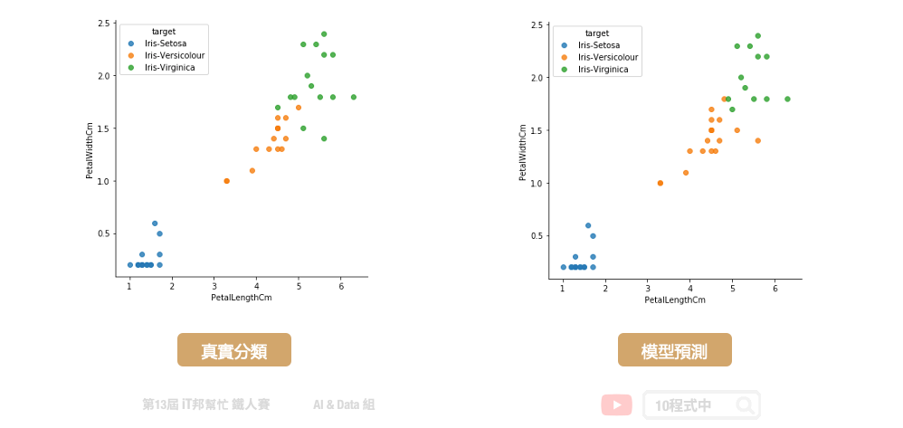

# 隨機森林 (Random forest)

## 今日學習目標
- 隨機森林介紹
    - 隨機森林的樹是如何生成？隨機森林的優點？
    - 隨機森林如何處理分類問題？
    - 隨機森林如何處理迴歸問題？
- 實作隨機森林分類器
    - 比較隨機森林與決策樹兩者差別。

<iframe width="560" height="315" src="https://www.youtube.com/embed/" frameborder="0" allow="accelerometer; autoplay; clipboard-write; encrypted-media; gyroscope; picture-in-picture" allowfullscreen></iframe>

範例程式：[]()

## 隨機森林
隨機森林其實就是進階版的決策樹，所謂的森林就是由很多棵決策樹所組成。隨機森林是使用 Bagging 加上隨機特徵採樣的方法所產生出來的整體學習演算法。還記得在前幾天的決策樹演算法中，當模型的樹最大深度設定太大的話容易讓模型過擬合。因此隨機森林藉由多棵不同樹的概念所組成，讓結果比較不容易過度擬合，並使得預測能力更提升。


## 隨機森林的生成方法
首先從訓練集中抽取 n’ 筆資料出來，然而這 n’ 筆資料是可以被重複抽取的。假設我們有一千筆資料我們要從中抽取 100 筆資料出來，這 100 筆資料裡面可能會有重複的數據。接著第二步從這些抽取出來的資料中挑選 k 個特徵當作決策因子的後選，因此每一棵樹只能看見部分的特徵。第三步重複以上步驟 m 次並產生 m 棵決策樹。透過 Bootstrap 步驟重複 m 次，做完之後我們會有 m 組的訓練資料，每一組訓練資料內都有 n’ 筆資料。最後再透過每棵樹的決策並採多數決投票的方式，決定最終預測的類別。因為隨機森林每一棵樹的特徵數量可能都不同，所以最後決策出來的結果都會不一樣。最後再根據任務的不同來做迴歸或是分類的問題，如果是迴歸問題我們就將這些決策數的輸出做平均得到最後答案，若是分類問題我們則用投標採多數決的方式來整合所有樹預測的結果。

1. 從訓練集中抽取 n’ 筆資料出來
2. n’ 筆資料隨機挑選 k 個特徵做樣本
3. 重複 m 次，產生 m 棵決策樹
4. 分類: 多數投票機制進行預測、迴歸: 平均機制進行預測



## 隨機森林中的隨機？
隨機森林中的隨機有兩種方面可以解釋。首先第一個是隨機取樣，在模型訓練的過程中每棵樹的生成都會先從訓練集中隨機抽取 n’ 筆資料出來，而這 n’ 筆資料是可以被重複抽取的。此抽取資料的方式又稱為 Bootstrap，它是一種在統計學上常用的資料估計方法。第二個解釋隨機的理由是在隨機森林中每一棵樹都是隨機的特徵選取。每一棵樹都是從 n’ 筆資料中隨機挑選 k 個特徵做樣本。

> 在 sklearn 中，最多隨機選取 𝑙𝑜𝑔<sub>2</sub>𝑁 個特徵

## 隨機森林的優點
- 每棵樹會用到哪些訓練資料及特徵都是由隨機決定
- 採用多個決策樹的投票機制來改善決策樹
- 與決策樹相比，不容易過度擬合
- 隨機森林每一棵樹都是獨立的
- 訓練或是預測的階段每一棵樹都能平行化的運行

## [程式實作]
## 隨機森林(分類器)

Parameters:
- n_estimators: 森林中樹木的數量，預設=100。
- max_features: 劃分時考慮的最大特徵數，預設auto。
- criterion: 亂度的評估標準，gini/entropy。預設為gini。
- max_depth: 樹的最大深度。
- splitter: 特徵劃分點選擇標準，best/random。預設為best。
- random_state: 亂數種子，確保每次訓練結果都一樣，splitter=random 才有用。
- min_samples_split: 至少有多少資料才能再分
- min_samples_leaf: 分完至少有多少資料才能分

Attributes:
- feature_importances_: 查詢模型特徵的重要程度。

Methods:
- fit: 放入X、y進行模型擬合。
- predict: 預測並回傳預測類別。
- score: 預測成功的比例。
- predict_proba: 預測每個類別的機率值。
- get_depth: 取得樹的深度。

```py
from sklearn.ensemble import RandomForestClassifier

# 建立 Random Forest Classifier 模型
randomForestModel = RandomForestClassifier(n_estimators=100, criterion = 'gini')
# 使用訓練資料訓練模型
randomForestModel.fit(X_train, y_train)
# 使用訓練資料預測分類
predicted = randomForestModel.predict(X_train)
```

### 使用Score評估模型
我們可以直接呼叫 `score()` 直接計算模型預測的準確率。

```py
# 預測成功的比例
print('訓練集: ',randomForestModel.score(X_train,y_train))
print('測試集: ',randomForestModel.score(X_test,y_test))
```

輸出結果：
```
訓練集:  1.0
測試集:  0.8888888888888888
```

我們可以查看訓練好的模型在測試集上的預測能力，下圖中左邊的是測試集的真實分類，右邊的是模型預測的分類結果。由於訓練資料筆數不多，因此模型訓練容易過度擬合訓練集的分布。最終在測試及預測的表現上僅有 0.88 的準確率。



### 特徵重要程度
只要是決策樹系列演算法，不管是分類器或是迴歸器都能透過 `feature_importances_` 來檢視模型預測對於特徵的重要程度。

```py
print('特徵重要程度: ',randomForestModel.feature_importances_)
```

輸出結果：
```
特徵重要程度:  [0.09864249 0.01363871 0.44211602 0.44560278]
```

## 隨機森林(迴歸器)

Parameters:
- n_estimators: 森林中樹木的數量，預設=100。
- max_features: 劃分時考慮的最大特徵數，預設auto。
- criterion: 評估切割點指標，mse/mae。
- max_depth: 樹的最大深度。
- splitter: 特徵劃分點選擇標準，best/random。預設為best。
- random_state: 亂數種子，確保每次訓練結果都一樣，splitter=random 才有用。
- min_samples_split: 至少有多少資料才能再分
- min_samples_leaf: 分完至少有多少資料才能分

Attributes:
- feature_importances_: 查詢模型特徵的重要程度。

Methods:
- fit: 放入X、y進行模型擬合。
- predict: 預測並回傳預測。
- score: 預測成功的比例。
- get_depth: 取得樹的深度。

```py
from sklearn.ensemble import RandomForestRegressor

# 建立RandomForestRegressor模型
randomForestModel = RandomForestRegressor(n_estimators=100, criterion = 'mse')
# 使用訓練資料訓練模型
randomForestModel.fit(x, y)
# 使用訓練資料預測
predicted=randomForestModel.predict(x)
```


本系列教學內容及範例程式都可以從我的 [GitHub](https://github.com/andy6804tw/2021-13th-ironman) 取得！