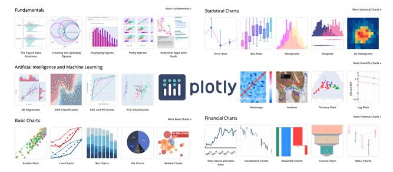
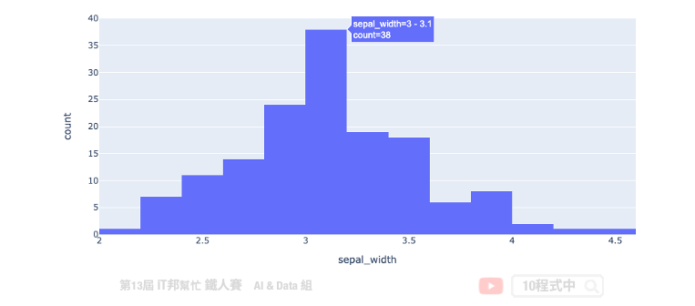
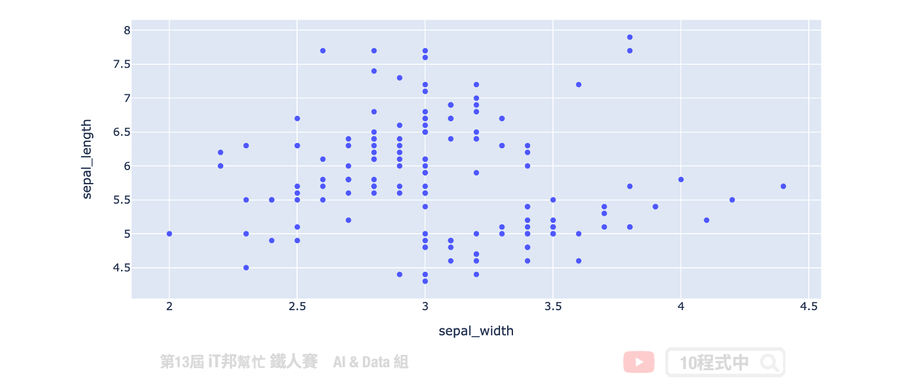
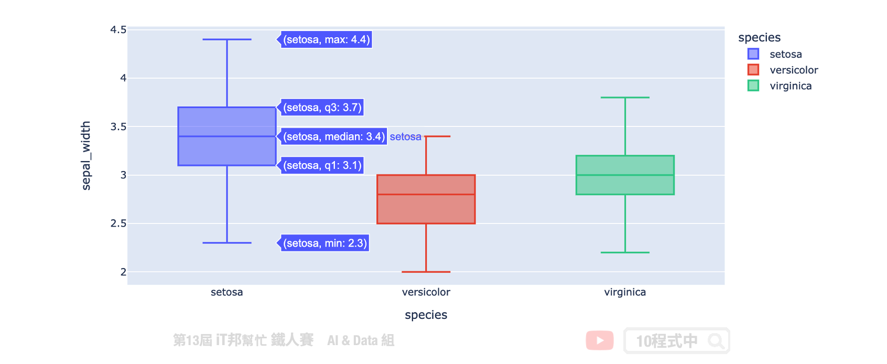
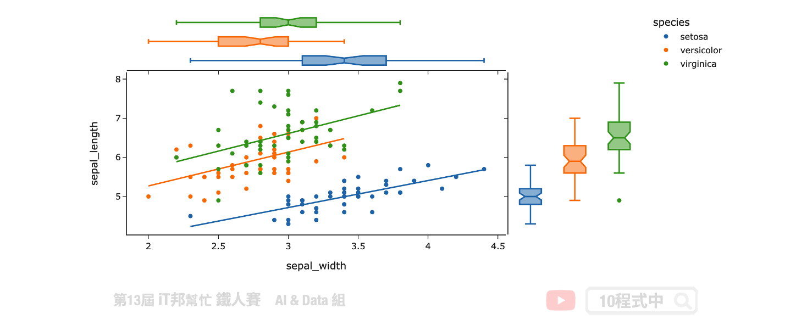

# Plotly Express
## 今日學習目標
- 安裝 plotly
- 手把手實作視覺化鳶尾花朵資料集
    - 直方圖
    - 特徵關聯度分析
    - 散佈圖
    - 箱形圖
    - 複合型視覺化技巧
    - 匯出圖片


範例程式：[](https://colab.research.google.com/github/andy6804tw/2021-13th-ironman/blob/main/docs/22.Plotly-Express/22.Plotly-Express.ipynb)

## 前言
Plotly Express 是一個高精緻的資料視覺化套件。初學機器學習的你一定碰過像是 matplotlib 和 seaborn 這類型的圖表化套件，不過使用過 Plotly Express 會讓你對於資料視覺化有更不一樣的體驗。它的功能使用起來非常直觀，並且可以很好地與 Pandas DataFrame 配合使用。[Plotly Express](https://plotly.com/python/plotly-express/) 於 2019 年由加拿大 Plotly 這間公司釋出了第一版高階的 Python 資料視覺化套件。



## 安裝 plotly
若尚未安裝此套件的讀者，可以開啟終端機輸入以下指令進行安裝：

```py
pip install plotly
```

## 1) 載入資料集
在今天的範例中我們一樣採用鳶尾花朵資料集來做示範，讓大家瞧瞧 Plotly Express 是如優雅的處理資料視覺化。

```py
import plotly.express as px
import plotly.graph_objects as go
from IPython.display import HTML

df_data = px.data.iris()
df_data
```


## 直方圖
為了更清楚了解特徵的分布狀況，我們可以採用直方圖 histogram 做更近一步的分析。從直方圖我們可以更清楚知道特徵的每個值的頻率分佈。由於目前版本在 Notebook 無法直接使用 `fig.show()` 顯示互動圖，必須安裝一些小插件模組與設定。因此範例中採用最簡單方法，先轉換成 HTML code 並透過 `IPython.display` 中的 HTML 方法顯示出來。

```py
fig = px.histogram(df_data, x="sepal_width")
HTML(fig.to_html())
```



除此之外我們也能觀察每一個獨立特徵對於花的品種的每個分布狀況。每個不同的顏色代表不同的花朵品種，我們可以藉由參數設定每個直方圖是否重疊，以及重疊的透明程度。

```py
fig = px.histogram(df_data, x="sepal_width", color="species")
fig.update_layout(barmode='overlay')
fig.update_traces(opacity=0.75)
HTML(fig.to_html())
```


接下來一樣透過直方圖方式來觀察每個花朵品種的數量。從視覺化可以很清楚得知該資料集是否是一個平穩的資料集。

```py
fig = px.histogram(df_data, x='species', y='sepal_width', histfunc='count', height=300,
                    title='Histogram Chart')
HTML(fig.to_html())
```


## 特徵關聯度分析
我們可以採用 `scatter_matrix` 為每一個特徵彼此間做一個關聯度分析。透過這種視覺化方式我們可以很清楚的知道兩個特徵間是否正相關與負相關。

```py
fig = px.scatter_matrix(df_data, dimensions=["sepal_width", "sepal_length", "petal_width", "petal_length"], color="species")
HTML(fig.to_html())
```


## 散佈圖
我們使用散佈圖將花萼的長度與寬度顯示在二維坐標平面上。使用 Plotly Express 套件中的 scatter 方法，我們可以輕鬆構建圖形，並放入 DataFrame 格式的資料並指定必要參數 x 軸中的變數和 y 軸中的變數。

```py
fig = px.scatter(df_data, x="sepal_width", y="sepal_length")
HTML(fig.to_html())
```



如果想要更清楚表達每個資料點所對應的類別，可以再加上 `color` 並指定種類的欄位即會將所有資料自動分成三類。此外我們也能夠設定滑鼠移到資料點上所顯示的資訊，透過 `hover_data` 並給予指定欄位即可看到輸出。

```py
fig = px.scatter(df_data, x="sepal_width", y="sepal_length", color="species"
                     , hover_data=['petal_length','petal_width'])
HTML(fig.to_html())
```


Plotly Express 也提供三維的視覺化，此外使用者也能夠過控制變版自由的放大與縮小甚至旋轉。下圖範例中我們將 x 軸設定花萼寬度，y 軸設定花萼長度，z 軸設定花瓣寬度。此外 `size` 可以控制每一個資料點的大小，這裡採用花瓣的長度做為每個資料點大小的依據。因此從這個立體空間可以發現從花瓣長度對於花的種類有很強的關聯性。

```py
fig = px.scatter_3d(df_data, x="sepal_width", y="sepal_length", z="petal_width", 
                    color="species",size='petal_length')
HTML(fig.to_html())
```


## 箱形圖
我們可以透過箱形圖進行特徵的分布狀況分析。從視覺化圖中可以清楚地知道花萼的寬度範圍介於 2~4.5 之間，以及四分位數和離群值的訊息。

```py
fig = px.box(df_data, y="sepal_width")
HTML(fig.to_html())
```


除此之外我們能夠更近一步的分析花萼寬度對於每個品種的分布狀況。

```py
fig = px.box(df_data, x="species", y="sepal_width",color="species")
HTML(fig.to_html())
```



## 複合型視覺化技巧
複合型視覺化方式可以同時預覽兩個變數間的散佈圖與箱型圖關係。主要是透過 `marginal_y` 與 `marginal_x` 設置橫軸與縱軸的視覺化方式，因此在一個圖表中可以結合兩種視覺化。此外 `trendline` 可以為散佈圖繪製趨勢線，設置 `ols` 會採用最小平方法位數據建立一個線性迴歸。

```py
fig = px.scatter(df_data, x="sepal_width", y="sepal_length", color="species", marginal_y="box",
           marginal_x="box", trendline="ols", template="simple_white")
HTML(fig.to_html())
```



也可以試著將橫軸與縱軸改成直方圖。

```py
fig = px.scatter(df_data, x="sepal_width", y="sepal_length", color="species", marginal_y="histogram",
           marginal_x="histogram", trendline="ols", template="simple_white")
HTML(fig.to_html())
```


## 匯出圖片
### 方法一
直接點選控制面板的相機圖示 (Download plot as a png) 可以立即下載圖片。


### 方法二
首先要安裝 kaleido 才能匯出 Plotly Express 的靜態圖片。

```bash
!pip install kaleido
```

- 匯出靜態圖片
```py
fig.write_image("./demo.png")
```

- 匯出網頁格式，保留互動形式
```py
fig.write_html("./demo.html")
```

## Reference
- [Plotly Express API Doc](https://plotly.com/python/plotly-express/)
- [Plotly Express GitHub](https://github.com/plotly/plotly_express)

> 本系列教學內容及範例程式都可以從我的 [GitHub](https://github.com/andy6804tw/2021-13th-ironman) 取得！