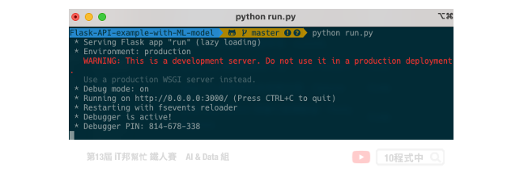
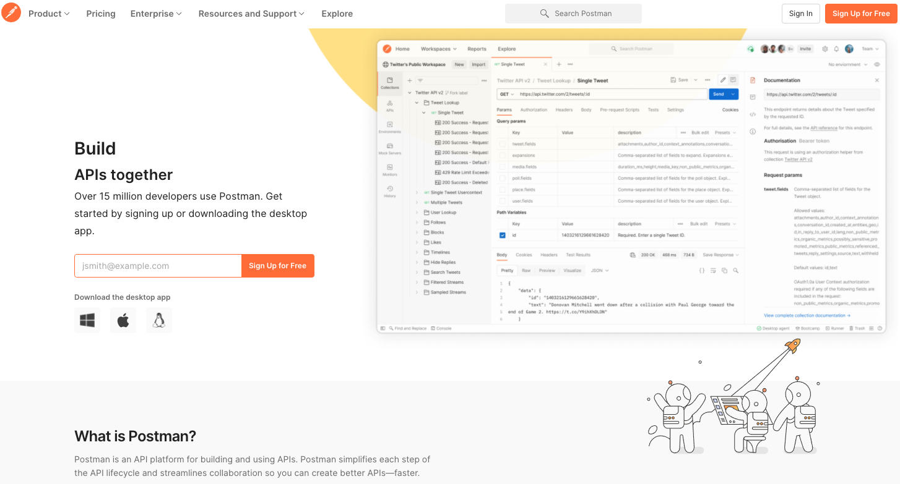
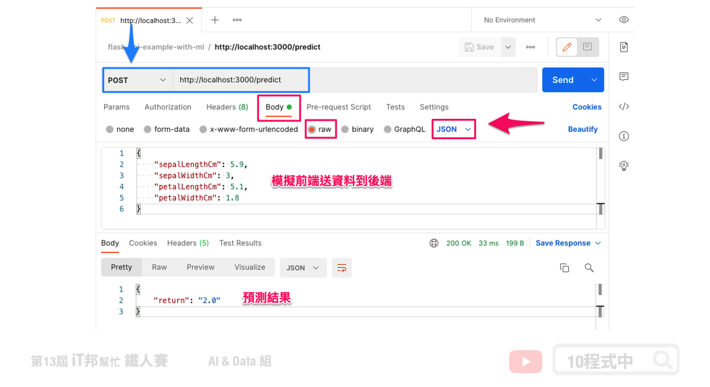

# [Day 29] 使用 Python Flask 架設 API 吧！

## 今日學習目標
- API 觀念講解
    - 什麼是 API？
    - RESTful API
    - HTTP Request 方法
- 手把手實作一個花朵分類器 API 
    - 透過 Python Flask 建置一個後端預測模型 API

<iframe width="560" height="315" src="https://www.youtube.com/embed/FUj88Q_L62k" frameborder="0" allow="accelerometer; autoplay; clipboard-write; encrypted-media; gyroscope; picture-in-picture" allowfullscreen></iframe>

範例程式：[Code](https://github.com/andy6804tw/2021-13th-ironman/tree/main/29.使用Python-Flask架設API吧/Flask-API-example-with-ML-model)


## 前言
當模型訓練完以後下一個步驟就是應用與落地。我們可以設計一個嵌入式系統與使用者互動，例如樹莓派、Jetson Nano、NeuroPilot...等硬體來協助 AI 模型的邊緣運算。或是設計一個手機 APP 以及網頁應用。很多人可能會有疑問模型訓練好然後下一個步驟該怎做？最常見的做法就是將訓練好的模型儲存起來並建立一個 API 部署在後端伺服器中，接著任何的終端設備都可以透過這一個 API 進行資料的存取與模型預測。下圖是一個簡單的模型落地的應用情境，我們可以在後端伺服器部署模型並建立一個 API 的接口與前端使用者互動。前端網頁的使用者透過 HTTP 的協定與後端伺服器進行通訊與資料交換，最終模型的預測結果會回傳到前端使用者並將結果選染在網頁上。我們延續昨天的內容 [[Day 28] 儲存訓練好的模型](https://ithelp.ithome.com.tw/articles/10280076)，目前已經成功的輸出模型。今天就來教各位如何透過 Python Flask 架設一個鳶尾花朵分類器的 API 吧！


## 什麼是 API？
所謂的 API 中文全名為應用程式介面 (Application Programming Interface) 是屬於客戶端與伺服端的溝通橋樑，它提供一個端口能夠進行資料交換。簡單來說是一個前端與後端的一個溝通介面。


另外大家可能聽過一個名詞叫做 RESTful API。所謂的 REST 為 Representational State Transfer 的縮寫是一種網路架構風格，近幾年來 REST 的概念已經被實作在大型網路系統中，而在 Web 服務中使用 REST 概念被實作出來的 API 就簡稱為 RESTful API 他是使用 HTTP 的協定完整定義 Web 服務在 HTTP Request 的各種流程。


## HTTP Request 方法
透過網路協定 HTTP Request 不同的方法，可以實現不同的資料交換請求方式。HTTP 本身就是 REST 的實作，所謂的 [HTTP Request](https://developer.mozilla.org/zh-TW/docs/Web/HTTP/Methods) 定義了八種請求方法分別為：

- [GET](https://developer.mozilla.org/en-US/docs/Web/HTTP/Methods/GET)：此方法只能向指定的資源要求取得資料，並不會更動到內部資源。
- HEAD：HEAD 跟 GET 方法類似只差別在它並不會回傳你所請求的資源在 body 上，只回傳 HTTP header。
- [POST](https://developer.mozilla.org/en-US/docs/Web/HTTP/Methods/POST)：向指定的資源提交資料。
- [PUT](https://developer.mozilla.org/en-US/docs/Web/HTTP/Methods/PUT)：向指定資源位置提交更新內容。
- [DELETE](https://developer.mozilla.org/en-US/docs/Web/HTTP/Methods/DELETE)：向指定資源位置請求刪除內容。
- CONNECT：HTTP/1.1協議中預留給能夠將連接改為管道方式的代理服務器。
- OPTIONS：此方法可使服務器傳回該資源所支持的所有 HTTP 請求方法。
- TRACE：回顯服務器收到的請求，主要用於測試或診斷。

## [程式實作] 鳶尾花朵分類器 API
## 建立 Python Flask API
Flask 是一個使用 Python 語言編寫的輕量級 Web 應用框架。在今日的文章中我們將延續昨天所儲存的鳶尾花朵分類器模型，建立一個花朵分類預測的 API。使用者可以透過 POST 協定從前端網頁發送四個數值分別為花萼的長與寬以及花瓣的長與寬。後端程式收到數值後送給事先打包好的模型，並將模型預測結果透過 JSON 格式回傳到前端使用者。以下為程式整個樹狀結構，其中在最外層資料夾有三個檔案分別有將模型封裝成函式的 `model.py` 與 Flask 主程式 `run.py` 以及負責管理專案套件的 `requirements.txt`。另外在 model 資料夾中負責儲存訓練好的模型壓縮檔。

```
.
├── model
│   └── xgboost-iris.pgz
├── model.py
├── requirements.txt
└── run.py
```

### 封裝預測模型 (model.py)
首先建立一個 `model.py` 檔案，在這個檔案中我們要載入事先訓練好的模型並將它封裝成一個 function 或是 class。在本範例程式中我們是建立一個 `predict()` 的函式並且允許接收一個 Numpy 的陣列，其中裡面允許夾帶四個花朵特徵的數值。最後將模型預測結果存放在 `pred` 變數中，並將預測的類別回傳。

```py
# -*- coding: UTF-8 -*-
import pickle
import gzip

# 載入模型
with gzip.open('./model/xgboost-iris.pgz', 'rb') as f:
    xgboostModel = pickle.load(f)

# 將模型預測寫成一個 function 
def predict(input):
    pred=xgboostModel.predict(input)[0]
    return pred
```

### 建立 Flask API (run.py)
接著我們要透過 Flask 建立一個 API，首先要設定開放跨網域 CORS 權限。所謂的跨來源資源共享 (Cross-Origin Resource Sharing, CORS) 是一種使用額外 HTTP 標頭來讓目前瀏覽網站的使用者能訪問不同來源網域的伺服器。當使用者請求一個來自於不同網域、通訊協定或通訊埠的資源時，會建立一個跨來源 HTTP 請求。所以在撰寫程式的時候必須透過 `flask_cors` 裡面所提供的 CORS 添加跨來源資源共享。這樣前端使用者在不同網域利用 ajax 或 fetch 存取 API 時就會有讀取權限。

```py
# -*- coding: UTF-8 -*-
import numpy as np
import model

from flask import Flask, request, jsonify
from flask_cors import CORS

app = Flask(__name__)
CORS(app)
```

接著我們先示範建立一個 GET 的路由 `@app.route('/')`，單引號內的內容即代表使用者在呼叫 API 的路徑位置 `/` 代表是 root 的意思。在這一個測試的路由中我們直接回傳一個 `hello!!` 的字串。稍後將會教各位如何透過 Postman 這個軟體來測試 API。另外第二個路由是負責接收花朵四個數值，並將這四個數值放到 Numpy 陣列中送到稍早以封裝好的 `mpdel.py` 中的 `predict()` 方法。並將預測的結果透過 JSON 格式回應給前端使用者。值得注意的是這一個路由我們是設定他的路徑為 `/predict` 以及 HTTP Requesst 的方法指定 `methods=['POST']`。

```py
@app.route('/')
def index():
    return 'hello!!'

@app.route('/predict', methods=['POST'])
def postInput():
    # 取得前端傳過來的數值
    insertValues = request.get_json()
    x1=insertValues['sepalLengthCm']
    x2=insertValues['sepalWidthCm']
    x3=insertValues['petalLengthCm']
    x4=insertValues['petalWidthCm']
    input = np.array([[x1, x2, x3, x4]])

    result = model.predict(input)

    return jsonify({'return': str(result)})
```

最後我們透過 `app.run()` 將此 API 部署在伺服器的 3000 PORT 當中。`host='0.0.0.0'` 表示預設路由將會自動幫你取得目前伺服器的固定 IP 位置。由於我們目前在本機開發等等測試時可以直接使用 `http://localhost:3000` 進行測試。另外參數 `debug` 設定為 True 即表示 API 被啟動時會自動監聽程式是否有變動，如果有更新內容即會立刻重新啟動 API。此設定適合在開發時候使用，而真正上線時再調成 False。

```py
if __name__ == '__main__':
    app.run(host='0.0.0.0', port=3000, debug=True)
```

### 管理套件版本 (requirements.txt)
`requirements.txt` 這一支檔案是負記錄了當前專案資料夾下程式所有依賴的套件及相對應的版本。下列五個是在本實作中將會使用到的套件，若套件後面沒有特別指定版本號，安裝時將會自動安裝最新的版本。

```
Flask
Flask-Cors
numpy
scikit-learn
xgboost
```

假設程式在另一台電腦上執行時，要一個一個安裝套件很麻煩。因此可以直接透過 `requirements.txt` 紀錄專案中依賴的套件。並且輸入以下指令即可一次安裝所有指定的套件。

```sh
pip install -r requirements.txt
```

## 執行 API
在本機或開發環境中測試執行 API 的方式很簡單。只要開啟終端機並輸入以下指令即可：

```sh
python run.py
```



> 程式真正上線時建議使用 gunicorn 或 Waitress 來產生 WSGI 服務，並於背景運行


還記得我們有寫一個 GET 方法的測試路由嗎？這時候大家可以開啟電腦中的瀏覽器並在網址列輸入 `http://localhost:3000` 即可立即看到 API 在指定的路徑下所回應的內容。如果出現以下畫面即代表 API 已經正常的被運行囉。


那你可能會問我該怎麼測試另一個 POST 方法呢？由於 GET 方法比較好處理，我們直接在瀏覽器輸入路徑就能立即觀看結果。那當我們要測試 POST、PUT、DELETE 等方法時就必須依靠第三方軟體 Postman 來協助模擬 HTTP Request 完成 API 測試。
## 測試 API 的好工具 Postman
當你寫好一支 API 時要馬上測試看看你寫的程式邏輯是否正確，就可以使用 Postman 這個軟體來做 API 測試。Postman 他是一個能夠模擬 HTTP Request 的工具能夠讓你簡單快速的測試你的 API，並且內建包含許多 HTTP 的請求方式，例如常見的 GET(取得)、POST(新增)、PUT(修改)、DELETE(刪除)。首先大家可以到[官網](https://www.postman.com/)下載與安裝。



安裝好之後可以打開程式並點選 POST 並貼上 API 網址。由於我們現在要測試另一個預測的路徑 `predict`，因此在網址列貼上 `http://localhost:3000/predict`。點選 Body-> raw -> JSON 並將花朵的四個參數以 JSON 格式進行描述。

```json
{
    "sepalLengthCm": 5.9,
    "sepalWidthCm": 3,
    "petalLengthCm": 5.1,
    "petalWidthCm": 1.8
}
```

點選 `send` 後即可將模擬的四個數值透過 JSON 格式使用 POST 方法傳送到後端 API 中的 `predict` 路徑。該 API 透過 POST 接收到前端使用者所發送的訊息後，解析這四個數值並依序放在陣列中並進行模型預測。最終預測結果會將花的種類以 JSON 格式回傳到前端使用者。此時前端的網頁設計師就可以將拿到的預測結果進行前端的畫面渲染與更新。



> 本系列教學內容及範例程式都可以從我的 [GitHub](https://github.com/andy6804tw/2021-13th-ironman) 取得！