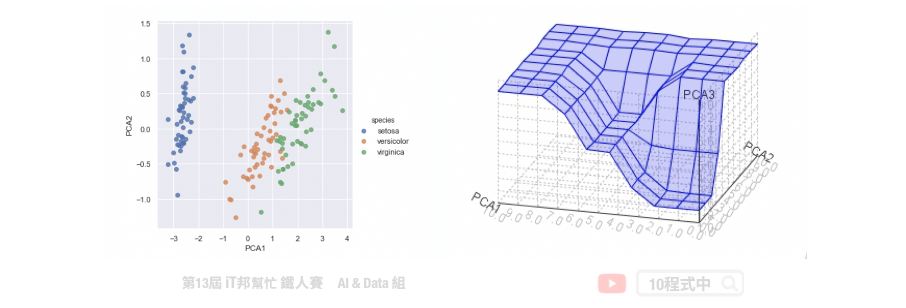
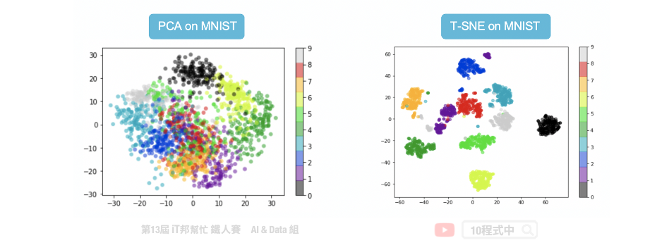
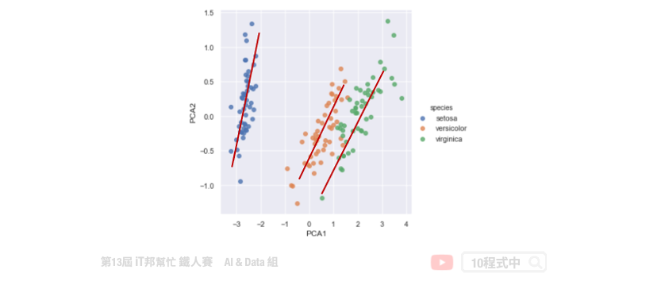
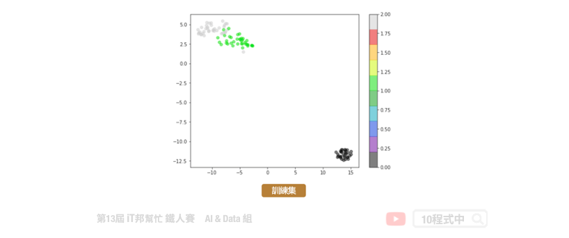

# 非監督式學習-降維

## 今日學習目標
- 降維觀念
    - 何謂降維? 降維有什麼優點?
- 常見兩種降維方法
    - PCA & t-SNE


範例程式：[](https://colab.research.google.com/github/andy6804tw/2021-13th-ironman/blob/main/docs/7.非監督式學習-降維/7.非監督式學習-降維.ipynb)

## 降維 (Dimension Reduction)
一般資料常見的表示方法有一維(數線)、二維(XY平面)和三維(XYZ立體)。當大於三維的資料就難以視覺化呈現，那麼我們該如何表示高維度的資料同時又不能壓縮原本資料間彼此的關連性呢？這時降維就能幫助你了！降維顧名思義，就是原本的資料處於在一個比較高的維度作標上，我們希望找到一個低維度的作標來描述它，但又不能失去資料本身的特質。


## 為什麼要降維?
想想看如果我們能夠把一些資料做壓縮，同時又能夠保持資料原來的特性。因此我們可以用比較少的空間，或是計算時用比較少的資源就可以得到跟沒有做資料壓縮之前得到相似的結果。此外資料降維可以幫助我們進行資料視覺化，二維可以用平面圖表示、三維可以用立體圖作表示，而大於三維的空間難以視覺化做呈現。



## 降維演算法
常見的降維方法有兩種分別有線性方法的主成分分析(PCA)以及非線性的 t-隨機鄰近嵌入法(t-SNE)。下圖例子是將 28*28 大小的手寫數字照片，分別透過上述兩種降維方法將一張 784 個像素的影像降成 2 維並投射在平面座標上。我們可以發現 PCA 降為後可以大致將 0~9 的手寫數字照片在平面上分成十群，不過彼此間的界線還是很模糊。而我們透過 t-SNE 方法降為後可以看到平面上很清楚的將這十個數字分成十群。因此我們可以得知手寫數字的影像在非線性的降維轉換效果是比較好的。

- Principal component analysis (PCA)
- T-Distributed Stochastic Neighbor Embedding (t-SNE)


因為 t-SNE 允許非線性的轉換，此外 t-SNE 使用了更複雜的公式來表達高維與低維之間的關係。因此在這種 0~9 有十個分類的情況下可以確保彼此間的距離會被區隔該而不會重疊。



## Principal component analysis (PCA)
主成份分析(Principal component analysis, PCA)。其主要目的是把高維的點頭影到低維的空間上，並且低維度的空間保有高維空間中大部分的性質。透過將一個具有 n 個特徵空間的樣本，轉換為具有 k 個特徵空間的樣本，其中 k 必定要小於 n。此外 PCA 只允許線性的轉換。如下圖所示，我們將捐尾花朵資料集進行 PCA 降維。將原有四個特徵分別有花瓣與花萼的長與寬，透過線性轉換成兩維並投射在平面上。我們可以發現三種花的類別在平面上各自都有線性的趨勢，也就是圖中紅色的線條。



### PCA的主要步驟
首先一開始先求出所有資料點中心 µ，也就是將每一個資料點的平均。接著將每一個資料點減去 µ，也就是做資料點的平移，平移後原點是所有點的中心。第三步計算特徵協方差矩陣，其中矩陣對角線上分別是每個特徵的方差，而非對角線上的數值是不同特徵間彼此的協方差。協方差是衡量兩個變數同時變化的變化程度，協方差絕對值越大兩者對彼此的影響越大。第四步驟對矩陣進行特徵值分解，計算協方差矩陣的特徵向量和特徵值並選取特徵向量。第五步驟將特徵值由小到大排序，並選取其中最大的 k 個特徵。然後將這些 k 個特徵向量作為特徵向量矩陣。最後對資料集中的每一個特徵轉換為新的特徵。

1. 先求出所有資料點中心 µ
2. 將每一個資料點減去 µ
3. 計算特徵的協方差矩陣
4. 對矩陣進行特徵值分解
5. 取出最大的 k 個特徵值對應的特徵向量
6. 將資料點投影到選取的特徵向量上


## T-Distributed Stochastic Neighbor Embedding (t-SNE)
t-SNE 目標跟 PCA 是一樣的，它們都希望把高維的資料投影到低維中，並且保留高維中的點與點之間的關係與特性。兩者不同的點在於 t-SNE 允許非線性的轉換。因為 t-SNE 使用了更複雜的公式來表達高維與低維之間的關係。主要是將高維的數據用高斯分佈的機率密度函數近似，而低維數據的部分使用 t 分佈的方式來近似。


## PCA & t-SNE 整理
PCA和t-SNE是兩個不同降維的方法，PCA的優點在於簡單若新的點要映射時直接代入公式即可得出降維後的點。若t-SNE有新的點近來時我們沒有去計算新的點和舊的點之間的關係因此 我們無法將新的點投影下去。t-SNE的優點是可以保留原本高維距離較遠的點降維後依然保持 遠的距離，因此這些群降維後依然保持群的特性。

- PCA允許線性的轉換
- t-SNE允許非線性的轉換

## [程式實作]

## PCA

```py
from sklearn.decomposition import PCA
pca = PCA(n_components=2, iterated_power=1)
train_reduced = pca.fit_transform(X_train)

print('PCA方差比: ',pca.explained_variance_ratio_)
print('PCA方差值:',pca.explained_variance_)
```


## t-SNE

```py
from sklearn.manifold import TSNE

tsneModel = TSNE(n_components=2, random_state=42,n_iter=1000)
train_reduced = tsneModel.fit_transform(X_train)
```



t-SNE 不適用於新資料。PCA 降維可以適用新資料，可呼叫transform() 函式即可。而 t-SNE 則不行。因為演算法的關係在 scikit-learn 套件中的 t-SNE 演算法並沒有transform() 函式可以呼叫。

## Reference
- [深入學習主成分分析（PCA）演算法原理及其Python實現](https://www.itread01.com/content/1547122639.html)

本系列教學內容及範例程式都可以從我的 [GitHub](https://github.com/andy6804tw/2021-13th-ironman) 取得！