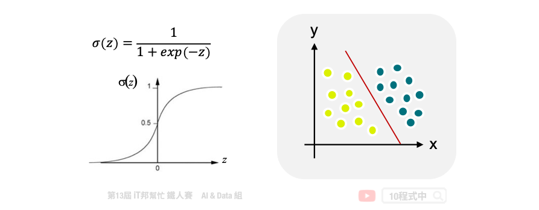
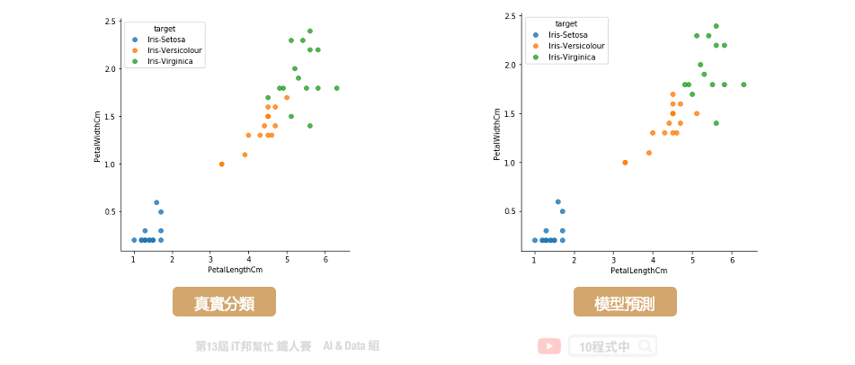

# 邏輯迴歸 (Logistic Regression)
## 今日學習目標
- 認識邏輯迴歸
    - 線性分類器
    - 邏輯迴歸學習機制
    - 比較線性迴歸與邏輯迴歸
    - 多元分類邏輯迴歸
- 邏輯迴歸程式手把手
    - 使用邏輯迴歸建立鳶尾花朵分類器

<iframe width="560" height="315" src="https://www.youtube.com/embed/" frameborder="0" allow="accelerometer; autoplay; clipboard-write; encrypted-media; gyroscope; picture-in-picture" allowfullscreen></iframe>

範例程式：[](https://colab.research.google.com/github/andy6804tw/2021-13th-ironman/blob/main/docs/9.邏輯迴歸/9.邏輯迴歸.ipynb)

## 認識邏輯迴歸
邏輯迴歸 (Logistic Regression) 是由線性迴歸變化而來的，它是一種分類的模型。其目標是要找出一條直線能夠將所有數據清楚地分開並做分類，我們又可以稱迴歸的線性分類器。邏輯迴歸其實是在說明一個機率的意義，透過一個 function 去訓練得到的一組參數，不同的 w,b 就會得到不同的 function。於是我們可以說 f<sub>w,b</sub>(x) 即為 posteriror probability。




## 線性迴歸與邏輯迴歸
邏輯迴歸是用來處理分類問題，目標是找到一條直線可以將資料做分類。主要是利用 sigmoid function 將輸出轉換成 0~1 的值，表示可能為這個類別的機率值。而線性迴歸是用來預測一個連續的值，目標是想找一條直線可以逼近真實的資料。


## 邏輯迴歸學習機制
邏輯迴歸是一個最基本的二元線性分類器。我們要找一個機率 (posterior probability) 當機率 P(C1|x) 大於 0.5 時則輸出預測 Class 1，反之機率小於 0.5 則輸出 Class 2。如果我們假設資料是 Gaussian 機率分佈，我們可以說這個 posterior probability 就是 𝜎(𝑧)。其中 ` z=w*x+b`，x 為輸入特徵，而 w 與 b 分別為權重(weight)與偏權值(bias) 他們是透過訓練得到的一組參數。


以下就是一個邏輯迴歸的運作機制，如果以圖像化表示會長這樣。我們的 function 會有兩組參數，一組是 w 我們稱為 weight，另一個常數 b 稱為 bias。假設我們有兩個輸入特徵，並將這兩個輸入分別乘上 w 再加上 b 就可以得到 z，然後通過一個 sigmoid function 得到的輸出就是 posterior probability。


在邏輯迴歸中我們定義的損失函數是要去最小化的對象是所有訓練資料 cross entropy 的總和。我們希望模型的輸出要跟目標答案要越接近越好。因此我們可以將最小化的目標寫成一個函數：


最後是尋找一組最好的參數，使得 loss 能夠最低。因此這裡採用梯度下降 (Gradient Descent) 來最小化交叉熵 (Cross Entropy)。我們將損失函數對權重求偏導後，可以得到下面的權重更新的式子：


## 多元分類邏輯迴歸 (Multinomial Logistic Regression)
在 Sklearn 中也能使用邏輯迴歸分類器應用在多類別的分類問題上，對於多元邏輯迴歸有 one-vs-rest(OvR) 和 many-vs-many(MvM) 兩種方法。兩者的做法都是將所有類別的資料依序作二元分類訓練。MvM 相較於 OvR 比較精準，但 `liblinear` 只支援 OvR。

- one-vs-rest(OvR): 訓練時把某個類別的資料歸為一類，其他剩餘的資料歸為另一類做邏輯迴歸，因此若有 k 個類別的資料會有 k 個二元分類器。假如有三個類別 A、B、C，首先抽取 A 類別的資料做為正集，B、C 類別資料做為負集; B 類別的資料作為正集，A、C 類別類別資料做為負集; C 類別的資料作為正集，A、B 類別類別資料做為負集。透過這三組訓練集分別進行訓練，然後的得到三個分類器 f1(x)、f2(x)、f3(x)。預測的時候就是把資料丟進三個分類器，查看哪個分類器預測的分數最高就決定該類別。
- many-vs-many(MvM): 與 OvR 差別在於訓練時每次只會挑兩個類別訓練一個分類器，因此 k 個類別的資料就需要 k(k-1)/2 個二元分類器。假如有三個類別 A、B、C，因此我們會有三組二元分類器分別有 (A、B)、(A、C) 與 (B、C)。訓練完成後當有新資料要預測時，把資料分別對三個二元分類器進行預測，最終多數決的方式得到預測結果。

## [程式實作]
## 邏輯迴歸 (分類器)
邏輯迴歸雖然有迴歸兩字但他其實是被用來做分類的，目的是要找出一條直線能夠將兩個類別分開。本範例採用鳶尾花朵資料集做分類器實驗，希望能夠透過線性分類器將三個類別彼此區隔開。

Parameters:
- penalty: 正規化l1/l2，防止模型過度擬合。
- C: 數值越大對 weight 的控制力越弱，預設為1。
- n_init: 預設為10次隨機初始化，選擇效果最好的一種來作為模型。
- solver: 優化器的選擇。newton-cg,lbfgs,liblinear,sag,saga。預設為liblinear。
- multi_class: 選擇分類方式，ovr就是one-vs-rest(OvR)，而multinomial就是many-vs-many(MvM)。預設為 auto，故模型訓練中會取一個最好的結果。
- max_iter: 迭代次數，預設為100代。
- class_weight: 若遇資料不平衡問題可以設定balance，預設=None。
- random_state: 亂數種子僅在solver=sag/liblinear時有用。

Attributes:
- coef_: 取得斜率。
- intercept_: 取得截距。

Methods:
- fit: 放入X、y進行模型擬合。
- predict: 預測並回傳預測類別。
- predict_proba: 預測每個類別的機率值。
- score: 預測成功的比例。


```py
from sklearn.linear_model import LogisticRegression

# 建立Logistic模型
logisticModel = LogisticRegression(random_state=0)
# 使用訓練資料訓練模型
logisticModel.fit(X_train, y_train)
# 使用訓練資料預測分類
predicted = logisticModel.predict(X_train)
```

### 使用Score評估模型
我們可以直接呼叫 `score()` 直接計算模型預測的準確率。

```py
# 預測成功的比例
print('訓練集: ',logisticModel.score(X_train,y_train))
print('測試集: ',logisticModel.score(X_test,y_test))
```

輸出結果：
```
訓練集:  0.9714285714285714
測試集:  0.9333333333333333
```

透過 Sklearn 的 `LogisticRegression` 可以實作一個典型的二元分類器。不過當有多個類別的時候，我們可以透過參數 `multi_class` 來設定多元分類器的學習機制。我們可以觀察一下訓練好的模型在測試集上的預測能力，為了方便觀察訓練結果，因此我們只挑選其中兩個特徵並繪製平面的點散圖。下圖中左邊的是測試集的真實分類，右邊的是模型預測的分類結果。




本系列教學內容及範例程式都可以從我的 [GitHub](https://github.com/andy6804tw/2021-13th-ironman) 取得！